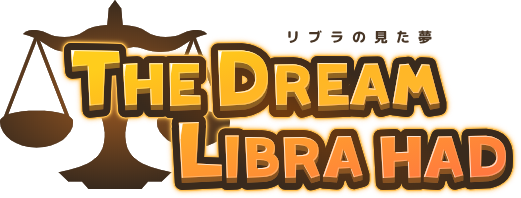

# The Dream Libra had - リブラの見た夢

The Dream Libra had is an Adventure Game made with [Phavuer](https://github.com/laineus/phavuer).

- [WebSite](https://libra.laineus.com/)
- [Steam](https://store.steampowered.com/app/1625720/)
- [GooglePlay](https://play.google.com/store/apps/details?id=com.laineus.libra)

# Build

```
# prod
$ yarn install
$ yarn run build
```

```
# dev
$ yarn install
$ yarn run dev
```

# Debug Tips

You can click `Ctrl` + `F9` key to activate debug features.

# Contribute to translation

1. Make an issue and branch (if not yet opened for the language)
2. Make laguage files under `/src/locales/*` according to `/src/locales/ja.js`
3. Recommend to commit frequently to avoid conflict
4. The MR will be merged after translated all

If some people contributing for the language,
You should declare that which files you will translate in issue to avoid duplication.

# Contributers

Simplified Chinese translations by [百合炼金工坊](https://yuriatelier.lofter.com/)
Help with English translation [datpd96](https://github.com/datpd96) 

# Licence

This source code is able to use in MIT Licence.
Assets such as graphics, sounds and scenario are not allowed to use.
